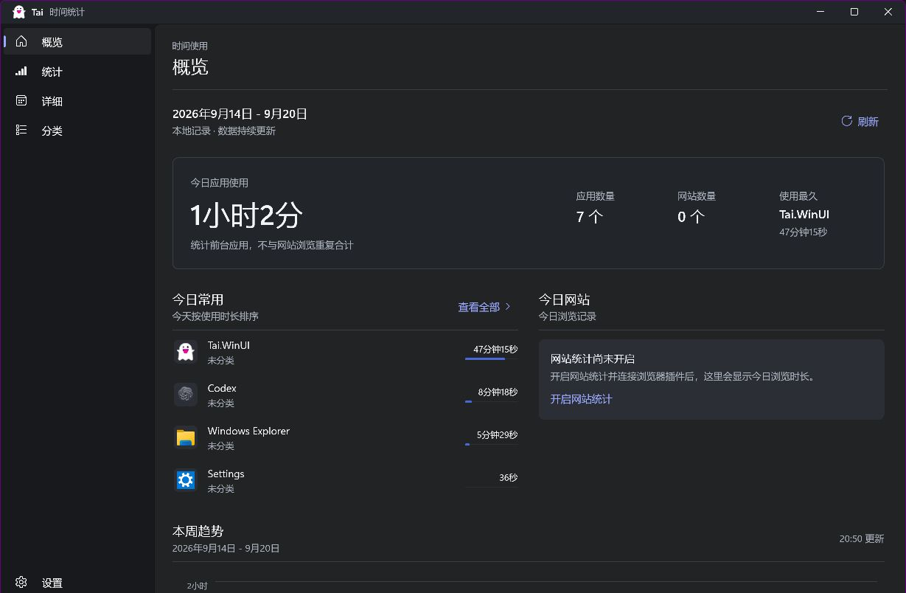

# Tai

Tai 是一款面向 Windows 的本地时间统计工具，用来记录应用使用时长和网站浏览时长，帮助你准确了解时间花在了哪里。

> [!IMPORTANT]
> Tai 的主线界面已经迁移到 **WinUI 3**。`Tai.WinUI` 是当前唯一维护、构建和发布的桌面端；`UI` 目录中的传统 WPF 界面仅保留为历史源码和迁移参考，不再新增功能、不再修复界面问题，也不再作为发布版本。



## WinUI 版本

当前版本围绕 WinUI 3 重建了桌面体验，同时继续复用 Tai 已有的本地统计、分类和 SQLite 数据能力。

- 使用 Fluent 风格的概览、统计、详细记录、分类和设置页面。
- 支持浅色、深色和跟随 Windows；主题配色经过文本、按钮、图表和选中状态的对比度检查。
- 支持桌面宽屏和窄窗口布局，启动测试覆盖 920、700 和 480 DIP 宽度。
- 修正使用占比的统计口径，明确应用、网站和分类数据的分母。
- 趋势图提供时长刻度，不再把尚未发生的时间段绘制为零。
- 网站统计关闭、暂无记录和读取失败会显示不同说明及对应入口。
- 详情页支持日、周、月、年范围，并显示明确的日期和分类信息。

## 功能

- 统计前台应用的使用时长。
- 按日、周、月和年查看趋势、排名及分类占比。
- 通过 Chrome、Microsoft Edge 等 Chromium 浏览器扩展统计当前标签页的网站浏览时长。
- 支持应用分类、运行目录匹配、关联进程、白名单、应用过滤、网址过滤和正则匹配。
- 支持睡眠监测，减少离开电脑时产生的无效记录。
- 支持导入、导出配置和数据库；统计数据可以导出为 `.xlsx` 与 `.csv`。
- 所有统计数据默认保存在本地，不需要账号或云端服务。

## 下载和运行

正式版本请查看 [Releases](https://github.com/ethandong16/Tai/releases)。请选择 WinUI 版本的 `win-x64` 发布包，解压后运行 `Tai.WinUI.exe`。

如果 Releases 尚未提供最新构建，可以在 [Build Tai WinUI](https://github.com/ethandong16/Tai/actions/workflows/winui-build.yml) 工作流的成功运行中下载 `tai-winui-win-x64` 构建产物。

运行要求：

- Windows 10 版本 1809（内部版本 17763）或更高版本。
- 64 位 Windows。
- 部分高权限应用的使用时间只能在 Tai 以管理员身份运行时被完整记录。

## 网站统计扩展

浏览器扩展位于 [`WebExtensions/Chrome`](WebExtensions/Chrome)，适用于 Chrome、Microsoft Edge 以及其他支持 Chrome 扩展的 Chromium 浏览器。

WinUI 发布包已附带扩展。在 Tai 的“设置 → 常规 → 功能”中，可以检测 Chrome、Edge、Brave、Vivaldi 和 Opera 的常见安装位置，分别或批量打开扩展安装页，并复制扩展目录。便携版或未识别的 Chromium 浏览器可手动打开扩展管理页，使用同一目录加载。Firefox 暂不支持。

这是辅助安装：打开页面后仍需在每个浏览器（或个人资料）中开启开发者模式并选择“加载已解压的扩展”。打开页面不表示安装成功；请开启 Tai 的网站浏览统计，再访问普通网页确认有浏览记录。加载后请保留 Tai 附带的扩展目录；移动 Tai 后需从新路径重新加载扩展。普通 Windows 环境无法通用地静默安装未上架的本地扩展，程序不会修改浏览器企业策略。

1. 启动 Tai，在“设置”中开启“网站浏览统计”。
2. 打开浏览器的扩展管理页面，例如 `chrome://extensions` 或 `edge://extensions`。
3. 开启“开发者模式”。
4. 选择“加载已解压的扩展”，然后选择 `WebExtensions/Chrome` 目录。
5. 扩展连接成功后，网站浏览记录会显示在 Tai 的概览、统计和详细页面中。

扩展使用 `tabs` 权限读取当前标签页信息，并通过本机 WebSocket 地址 `ws://127.0.0.1:8908/TaiWebSentry` 与 Tai 通信。数据不会因此上传到远程服务器。

## 从源码构建

### 环境

- .NET 8 SDK。
- Visual Studio 2022 17.10 或更高版本，或可用的 MSBuild 环境。
- Windows App SDK `1.6.240829007`。
- Windows 10 SDK `10.0.19041` 或兼容版本。

传统 WPF 工程不再是构建目标。请直接构建 `Tai.WinUI/Tai.WinUI.csproj`，不要以旧 `UI` 工程作为启动项目。

### 发布自包含 WinUI 版本

```powershell
dotnet restore Tai.WinUI/Tai.WinUI.csproj -r win-x64

dotnet publish Tai.WinUI/Tai.WinUI.csproj `
  -c Release `
  -p:Platform=x64 `
  -p:RuntimeIdentifier=win-x64 `
  -p:SelfContained=true `
  -p:WindowsAppSDKSelfContained=true `
  -p:EnableMsixTooling=true `
  --no-restore
```

发布目录：

```text
Tai.WinUI/bin/x64/Release/net8.0-windows10.0.19041.0/win-x64/publish
```

运行发布结果：

```powershell
& "Tai.WinUI/bin/x64/Release/net8.0-windows10.0.19041.0/win-x64/publish/Tai.WinUI.exe"
```

### 启动和界面回归测试

```powershell
powershell -ExecutionPolicy Bypass `
  -File scripts/Test-WinUIStartup.ps1 `
  -PublishDirectory "Tai.WinUI/bin/x64/Release/net8.0-windows10.0.19041.0/win-x64/publish"
```

测试会检查发布资源、应用启动、数据库查询、浅色和深色主题、标题栏、七个页面、四种统计周期以及多种窗口宽度。

## 项目结构

| 目录 | 状态 | 说明 |
| --- | --- | --- |
| `Tai.WinUI` | 当前主线 | WinUI 3 桌面应用和 Fluent 界面 |
| `Core.Modern` | 当前主线 | 将共享核心源码编译到 .NET 8 Windows，供 WinUI 使用 |
| `Core` | 共享核心 | 应用监测、网站服务、分类、配置和 SQLite 数据服务 |
| `WebExtensions/Chrome` | 当前维护 | Chromium 网站统计扩展 |
| `scripts` | 当前维护 | WinUI 发布与启动验证脚本 |
| `UI` | 已停止维护 | 传统 WPF 界面，仅保留为历史实现和资源迁移参考 |
| `Updater` | 历史项目 | 旧版更新程序，不属于当前 WinUI 发布流程 |
| `TaiBug` | 历史项目 | 旧版崩溃处理程序，不属于当前 WinUI 发布流程 |

`Core.Modern` 会复用 `Core` 中的源码，因此保留 `Core` 不代表传统 WPF UI 仍在维护。

## 数据和隐私

- 统计数据库：`Data/data.db`
- 配置文件：`Data/AppConfig.json`
- 启动日志：`Log/startup.log`
- 网站扩展仅与本机 Tai 服务通信。
- 项目不提供账号体系、云同步或统计数据上传功能。
- Tai 可能下载网站 favicon 并缓存在本地，用于网站列表展示。

删除程序目录即可卸载。需要保留历史记录时，请先备份 `Data` 目录。

## 贡献

新功能、修复和界面改进应提交到 `Tai.WinUI`。除迁移共享资源或移除遗留依赖外，请不要再向传统 `UI` 工程增加功能。

欢迎通过 [Issues](https://github.com/ethandong16/Tai/issues) 报告问题，或通过 [Pull Requests](https://github.com/ethandong16/Tai/pulls) 提交改进。

## 许可证

Tai 使用 [MIT License](LICENSE) 发布。
